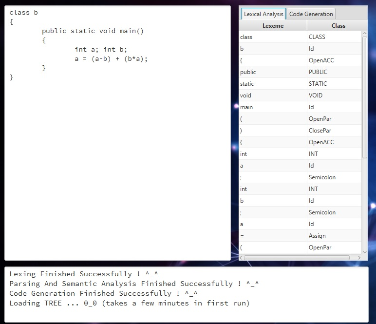

# Mini JAVA Compiler

#### Lexer, Parser, Tree Drawer, Code Generator for Mini Java

## Features

* All Levels of A Compiler
* Uses [Antlr4](https://www.antlr.org/)
* Draw Parse Tree
* Semantic and Syntax error detection
* Good UI with JavaFX

## Build

* Open project with Intellij Idea
* Connect to Internet to download Maven repository
* Compile And Enjoy!!!!

## Previews

##### Lexer :

##### Tree :

##### Code Generator : 

##### Error Detection :

